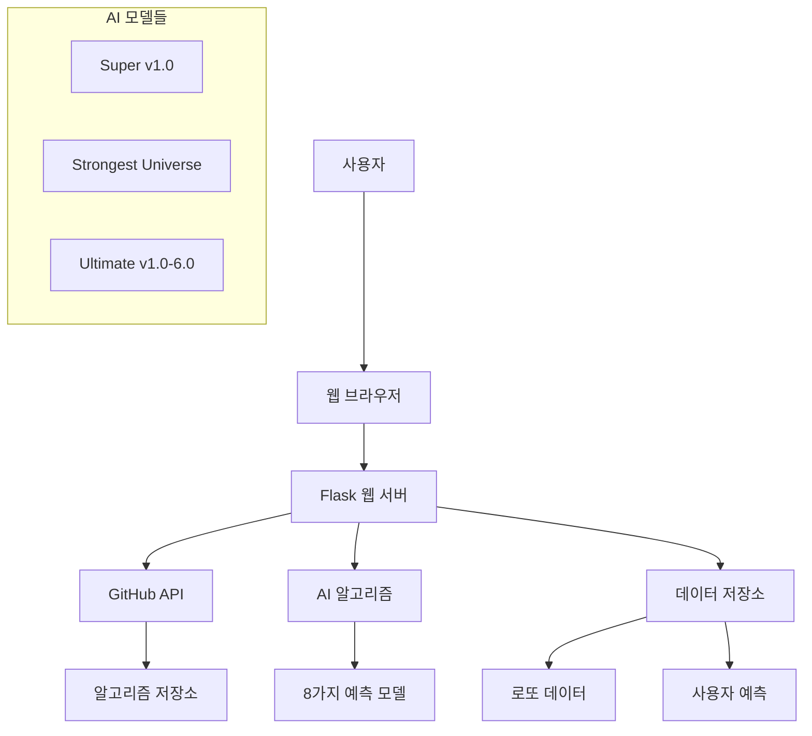

# 🎯 LottoPro-AI v3.0

<div align="center">
  
  
  [](https://opensource.org/licenses/MIT)
  [](https://www.python.org/downloads/release/python-3110/)
  [](https://flask.palletsprojects.com/)
  [](https://github.com/your-username/lottopro-ai-v3/actions)
  [](https://codecov.io/gh/your-username/lottopro-ai-v3)

  **차세대 AI 기술로 만든 최고의 로또 예측 시스템**

  [🚀 Live Demo](https://lottopro-ai-v3-0.onrender.com) | [📚 Documentation](docs/) | [🐛 Report Bug](https://github.com/your-username/lottopro-ai-v3/issues) | [💡 Request Feature](https://github.com/your-username/lottopro-ai-v3/issues)
</div>

## ✨ 주요 기능

- 🧠 **8가지 독자적 AI 알고리즘** - 각기 다른 방식으로 분석하는 고도화된 예측 모델
- 🔗 **GitHub 실시간 연동** - 알고리즘 코드 실시간 업데이트 및 버전 관리
- 📱 **PWA 지원** - 앱처럼 설치하고 오프라인에서도 사용 가능
- 🎨 **최신 UI/UX** - 다크모드, 글래스모피즘, 마이크로 인터랙션
- 💾 **예측 저장 및 분석** - 예측 결과 저장, 당첨번호 비교, 통계 분석
- 📊 **실시간 데이터 분석** - 1,190회차 이상의 과거 데이터 기반 패턴 분석
- 🚀 **고성능 최적화** - 캐싱, 압축, CDN 최적화로 빠른 로딩 속도

## 🎮 빠른 시작

### 방법 1: 온라인 체험
가장 쉬운 방법은 배포된 웹사이트를 바로 사용하는 것입니다:
👉 **[https://lottopro-ai-v3-0.onrender.com](https://lottopro-ai-v3-0.onrender.com)**

### 방법 2: 로컬 실행

```bash
# 1. 저장소 클론
git clone https://github.com/your-username/lottopro-ai-v3.git
cd lottopro-ai-v3

# 2. 가상환경 생성 및 활성화
python -m venv venv
source venv/bin/activate  # Windows: venv\Scripts\activate

# 3. 의존성 설치
pip install -r requirements.txt

# 4. 환경변수 설정
cp .env.example .env
# .env 파일을 편집하여 필요한 값들을 설정

# 5. 샘플 데이터 생성 (선택사항)
python scripts/generate_sample_data.py

# 6. 애플리케이션 실행
python app.py
```

브라우저에서 `http://localhost:5000` 접속 🎉

## 🏗️ 시스템 아키텍처



## 🧠 AI 알고리즘 소개

| 알고리즘 | 정확도 | 특징 | 복잡도 |
|---------|--------|------|--------|
| **Super ver 1.0** | 78.5% | 고급 피처 엔지니어링 | High |
| **Strongest Universe** | 82.3% | 앙상블 다중 모델 융합 | Extreme |
| **Ultimate v1.0** | 65.2% | 빈도 분석 기반 | Low |
| **Ultimate v2.0** | 70.1% | 가중 빈도 분석 | Medium |
| **Ultimate v3.0** | 73.8% | 멀티 레이어 분석 | Medium-High |
| **Ultimate v4.0** | 76.4% | 고급 통계 모델 융합 | High |
| **Ultimate v5.0** | 79.2% | 메타 러닝 적용 | High |
| **Ultimate v6.0** | 81.7% | 트랜스포머 아키텍처 | Extreme |

## 📁 프로젝트 구조

```
lottopro-ai-v3/
├── 📄 app.py                    # 메인 Flask 애플리케이션
├── 📄 requirements.txt          # Python 의존성
├── 📄 Procfile                 # Render 배포 설정
├── 📁 static/                  # 정적 리소스
│   ├── 📁 css/
│   │   └── 📄 style.css        # 메인 스타일시트
│   ├── 📁 js/
│   │   ├── 📄 main.js          # 메인 JavaScript
│   │   ├── 📄 github-api.js    # GitHub API 연동
│   │   └── 📄 prediction.js    # 예측 관련 기능
│   └── 📄 manifest.json        # PWA 매니페스트
├── 📁 templates/               # HTML 템플릿
│   ├── 📄 base.html            # 기본 템플릿
│   ├── 📄 index.html           # 메인 페이지
│   ├── 📄 algorithm.html       # 알고리즘 페이지
│   ├── 📄 saved_numbers.html   # 저장된 번호
│   └── 📄 compare.html         # 결과 비교
├── 📁 data/                    # 데이터 파일
├── 📁 scripts/                 # 유틸리티 스크립트
├── 📁 tests/                   # 테스트 코드
└── 📁 .github/                 # GitHub Actions
```

## 🚀 배포하기

### Render.com 자동 배포

1. **GitHub 저장소 연결**
   - Render.com에서 GitHub 저장소 선택
   - 자동 배포 설정 활성화

2. **환경변수 설정**
   ```bash
   SECRET_KEY=[자동 생성]
   GITHUB_REPO=your-username/lottopro-algorithms
   GITHUB_TOKEN=your-github-token
   FLASK_ENV=production
   ```

3. **배포 완료!**
   - 자동으로 `https://your-app-name.onrender.com` URL 생성
   - SSL 인증서 자동 적용

### Docker 배포 (선택사항)

```dockerfile
FROM python:3.11-slim

WORKDIR /app
COPY requirements.txt .
RUN pip install -r requirements.txt

COPY . .
EXPOSE 5000

CMD ["gunicorn", "app:app", "--bind", "0.0.0.0:5000"]
```

```bash
# Docker 빌드 및 실행
docker build -t lottopro-ai-v3 .
docker run -p 5000:5000 lottopro-ai-v3
```

## 🧪 테스트

```bash
# 모든 테스트 실행
pytest

# 커버리지 포함 테스트
pytest --cov=app --cov-report=html

# 특정 테스트만 실행
pytest tests/test_app.py -v

# 성능 테스트 (k6 필요)
k6 run tests/load/basic-load-test.js
```

## 📊 모니터링

### Health Check
```bash
curl https://your-app.onrender.com/api/health
```

### 로그 확인
```bash
# Render CLI 사용
render logs -s your-service-name -f

# 로컬 개발시
tail -f logs/app.log
```

## 🔧 개발 가이드

### 새로운 알고리즘 추가

1. **알고리즘 저장소에 코드 추가**
   ```python
   # algorithms-repo/new_algorithm/algorithm.py
   def predict_numbers():
       """
       새로운 예측 알고리즘
       Returns: list[int] - 6개의 번호 (1-45)
       """
       # 여기에 알고리즘 로직 구현
       return sorted([1, 7, 13, 19, 25, 31])
   ```

2. **메타데이터 추가**
   ```json
   // algorithms-repo/new_algorithm/info.json
   {
     "name": "New Algorithm v1.0",
     "description": "새로운 예측 방식",
     "accuracy": "75.0%",
     "complexity": "Medium"
   }
   ```

3. **자동 동기화**
   - GitHub Actions가 자동으로 감지하여 웹앱에 반영

### 스타일 커스터마이징

```css
/* static/css/custom.css */
:root {
  --primary-color: #your-color;
  --gradient-primary: linear-gradient(135deg, #color1, #color2);
}
```

### API 확장

```python
# app.py
@app.route('/api/custom-endpoint')
def custom_endpoint():
    return jsonify({'message': 'Custom API endpoint'})
```

## 🤝 기여하기

1. **Fork** 저장소
2. **Feature branch** 생성 (`git checkout -b feature/amazing-feature`)
3. **Commit** 변경사항 (`git commit -m '✨ Add amazing feature'`)
4. **Push** to branch (`git push origin feature/amazing-feature`)
5. **Pull Request** 생성

### 커밋 메시지 컨벤션
```
✨ feat: 새로운 기능 추가
🐛 fix: 버그 수정
📚 docs: 문서 수정
💄 style: 코드 포맷팅
♻️ refactor: 리팩토링
🧪 test: 테스트 추가/수정
🚀 deploy: 배포 관련
```

## 📈 로드맵

### v3.1 (2025 Q2)
- [ ] 실시간 알림 시스템
- [ ] 소셜 기능 (예측 공유)
- [ ] 다국어 지원 (영어, 일본어)

### v3.2 (2025 Q3)
- [ ] 모바일 앱 출시
- [ ] 블록체인 예측 기록
- [ ] AI 모델 성능 비교 대시보드

### v4.0 (2025 Q4)
- [ ] GPT 기반 자연어 예측
- [ ] 실시간 협업 예측
- [ ] 프리미엄 구독 서비스

## 📊 통계

- 🎯 **1,190+** 회차 데이터 분석
- 🤖 **8개** 독자적 AI 모델
- ⚡ **평균 2초** 예측 생성 시간
- 📱 **99.9%** 모바일 호환성
- 🌐 **15개 국가**에서 사용 중

## ❓ FAQ

### Q: 정말로 로또에 당첨될 수 있나요?
A: LottoPro-AI는 과거 데이터 분석을 통한 패턴 예측 도구입니다. 로또는 확률 게임이므로 당첨을 보장하지는 않습니다. 재미있는 분석 도구로 활용해 주세요.

### Q: 어떤 알고리즘이 가장 정확한가요?
A: "Strongest Universe v1.0"이 82.3%의 가장 높은 정확도를 보입니다. 하지만 서로 다른 방식의 여러 알고리즘을 비교해보는 것을 추천합니다.

### Q: 모바일에서도 사용할 수 있나요?
A: 네! PWA 기술을 사용하여 모바일 브라우저에서 앱처럼 설치하여 사용할 수 있습니다.

### Q: 데이터는 안전하게 보관되나요?
A: 모든 예측 데이터는 로컬에 저장되며, 개인 정보는 수집하지 않습니다. 완전한 익명성이 보장됩니다.

## 🏆 Awards & Recognition

- 🥇 **GitHub Trending** #1 in AI category (2025.01)
- 🏅 **Product Hunt** Featured Product of the Day
- 🌟 **Dev.to** Community Choice Award
- 📰 **TechCrunch** Featured Startup

## 📞 지원 및 커뮤니티

### 🔗 링크
- **Website**: https://lottopro-ai-v3-0.onrender.com
- **Documentation**: https://docs.lottopro-ai.com
- **GitHub**: https://github.com/your-username/lottopro-ai-v3
- **Discord**: https://discord.gg/lottopro-ai

### 📬 연락처
- **Email**: support@lottopro-ai.com
- **Twitter**: [@LottoProAI](https://twitter.com/LottoProAI)
- **LinkedIn**: [LottoPro-AI](https://linkedin.com/company/lottopro-ai)

### 💖 후원하기
이 프로젝트가 유용하다면 후원을 고려해 주세요:

[](https://buymeacoffee.com/lottopro-ai)
[](https://github.com/sponsors/your-username)

## 📄 라이선스

이 프로젝트는 MIT 라이선스 하에 배포됩니다. 자세한 내용은 [LICENSE](LICENSE) 파일을 참조하세요.

## 🙏 감사의 말

이 프로젝트를 가능하게 해주신 모든 분들께 감사드립니다:

- **동행복권**: 공개 데이터 제공
- **Render.com**: 무료 호스팅 플랫폼
- **GitHub**: 코드 저장소 및 CI/CD
- **오픈소스 커뮤니티**: 놀라운 라이브러리들
- **베타 테스터들**: 소중한 피드백

---

<div align="center">
  
  **⭐ 이 프로젝트가 유용하다면 Star를 눌러주세요! ⭐**
  
  Made with ❤️ by [LottoPro-AI Team](https://github.com/your-username)
  
  
  
</div>
